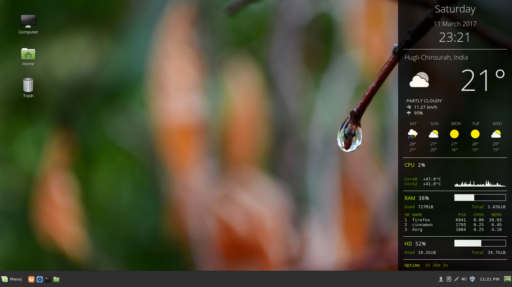

# ConkyAwesome

    

Information
-----------

<table>
   <tr>
      <td>Author</td>
      <td>Pratanu Mandal</td>
   </tr>
   <tr>
      <td>Website</td>
      <td>www.pratanumandal.tk</td>
   </tr>
   <tr>
      <td>License</td>
      <td>GPL-3.0+</td>
   </tr>
   <tr>
      <td>Version</td>
      <td>2.0</td>
   </tr>
   <tr>
      <td>Date</td>
      <td>11 / 03 / 2017</td>
   </tr>
</table>
  

Requirements
------------

Fonts:     'Open Sans Light' and 'DejaVu Sans Mono' 
Packages:  'conky' and 'curl'   
OS:        Linux

Note
----

Some of the files may be hidden. To see all files unhide them in your file manager. 
In general most file managers recognize the "Ctrl+H" keyboard shortcut for hiding/unhiding files. 
 
The conky might not fit in your screen, depending on your screen size. 
In such cases, consider removing some of the components by simple deleting the code for those components in .conkyrc file.
The file has been clearly labelled to help identify the components. You may also make more indepth changes to the conky in order to fit it into your screen if you are proficient in writing conky.   

Installation Instructions
-------------------------

1. &emsp;First install "conky" if you don't have it, also ensure that you have "curl" installed. 

2. &emsp;Extract contents of the archive. 

3. &emsp;Download and install fonts: 
   &emsp;(a) Install 'Open Sans Light' font from the following link: 
   &emsp;&emsp;&emsp;&emsp;http://www.opensans.com/ 

   &emsp;(b) Install 'DejaVu Sans Mono' font from  the following link: 
   &emsp;&emsp;&emsp;&emsp;https://www.fontsquirrel.com/fonts/dejavu-sans-mono 

3. &emsp;Copy ".conkyrc" file and ".conky-awesome-assets" directory to the home directory. 

4. &emsp;Open the file ".conkyrc" in the home directory with a text editor, search for "2278277" and replace it with the WOEID of your own location. 
   &emsp;To find your WOEID, browse or search for your city from the Yahoo Weather home page:  http://weather.yahoo.com/ 
   &emsp;The WOEID is in the URL of the forecast page for that city. 

5. &emsp;Add "conky" to your Startup Applications. 

6. &emsp;Reboot or log out and log back in.   

Credits & Acknowledgements
--------------------------

This work is derived from 'Conky Google Now', originally by 'satya164'. 
Link: http://satya164.deviantart.com/art/Conky-Google-Now-366545753  

------------------------------------------------------------------------------

Hope you enjoy using it. 
If you face any bugs or problems regarding this conky feel free to contact me. 
Also, I would love to receive your feedback. 
